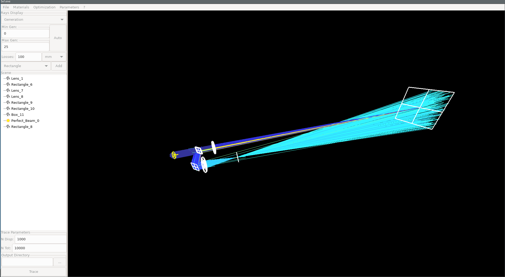
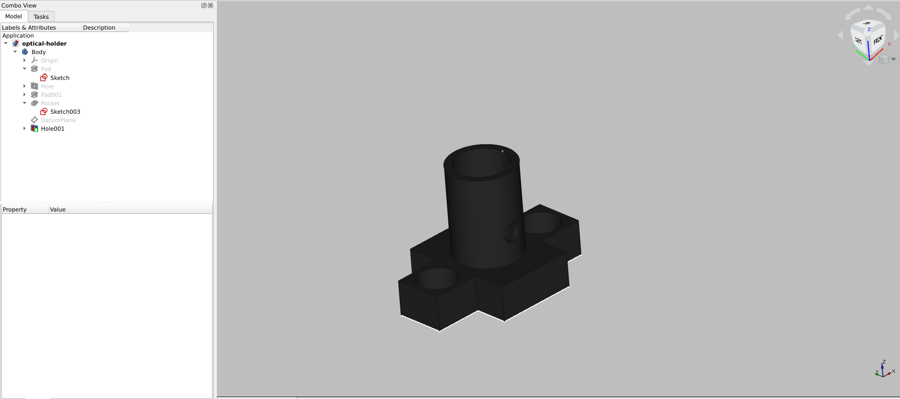
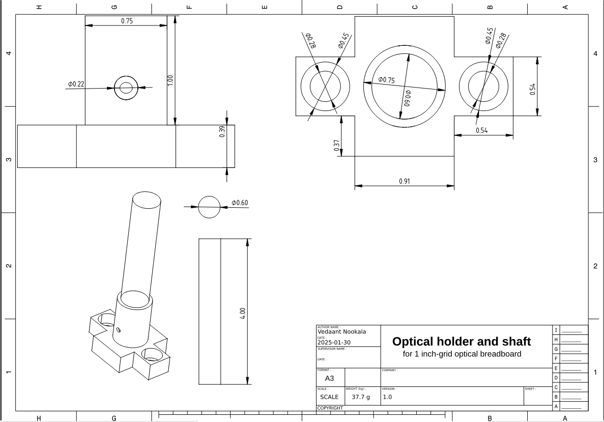

# Log 1

#### Aether Simulation

Started playing around with the Aether simulation, testing out various parameters and components. 
The simulation seems to fit in line with the calculations regarding focal lengths given standard lens sizes. 

The projector lens was given to have a throw distance between 1.5 and 12 meters, so I thought 6 meters would be a good middle ground, giving enough range to adjust the focus later on. 

The simulation was intended to test if the calculations regarding focal length using the in-contact compound lens equation, was correct. 

The light source was modelled as a collaminated polychromatic beam, with a roughly equal "distribution" of wavelengths between 100nm and 870nm.
This is likely a gross simplification of the focusing mechanism in the projector, as there are likely multiple sets of optics that move to allow for the focal point to change between 1.5 and 12 meters,
however for the purpose of the simulation it was abstracted. **all that matters is that the light focuses to a point roughly 6 meters away**

The initial projector lens seems to work as intended, focusing the incoming collaminated beams to a point on a screen 6 meters away, however the compound lens system focused the light closer than the
expected 500 millimeters from the lens, at around 400-450 mm. I can probably write this off as the distance the light travels within the lens (each of thickness 10mm) as well as the small gap between them.
Theoretically the projectors adjustable focus should be able to account for this, but its better to be safe than sorry and i'll recalculate the real focusing point using the compound lens equation accounting
for lens thickness and gap. 

This matters later on in the project, as i'll have to use a double concave lens to collaminate the light so that it can travel through the optical aperature before reaching the objective lens. 

I have to be honest I still dont fully understand how the optics inside of an objective lens work, specifically regarding FOV and if the incoming beams need to fully "fill" the aperature, and what
impact this might have on the outgoing beam. 

##### problems

biggest problem (which should be obvious from the image) is that the beam splitter isnt... splitting the beam. 
the idea was to simulate a beam splitter which used a thin aluminum coating, such that it passed light in the UV spectrum (100-400 nm) and reflected light in the visible spectrum and above. 
though not crucial to the project, having a dichroic beam splitter helps by not funneling UV light directly into your eye/camera sensor. This could also be avoided by using a UV filter for the
light entering the eye piece, but that would add extra components (and extra cost) to the project. 

As mentioned previously, the beam splitter should theoretically pass UV light "straight" ahead, while reflecting visible light to the second setup (used to test the focal point of a compound lens). 

I tried various setups, namely

- **single rectangle with aluminum coating on one side**
  - this setup lead to a portion of the light being reflected as expected, and entering the second optical setup.
  - the light that "passed" through the beam splitter wasn't colinear with the rest of the system, coming out at an angle. Given that snells law states $n_1sin(\theta_1)=n_2sin(\theta_2)=...n_{final}sin(\theta_{final})$, and that the initial and final materials are the same (air), then the incoming and outgoing angle should be the same, with a bit of offset due to travel in the medium. In this case it wildly shifted the outgoing angle, so im really not sure whats happening. Maybe theres some surface interaction or scattering its simulating that im not considering?
- **Two rectangles, with the first being a thin layer of aluminum and the second being glass**
  - this didnt work due to the fact that the aluminum layer was reflecting the entire portion of light. Again, not sure why. I'm still unsure of how the "inner" and "outer" surface parameters of each material work, so I might have to work with that.

I eventually settled on using a glass block in the simulation. Given the number of faces, I havent figured out the actual "orientation" or which face corresponds to what parameters. 

Reading through the docs I did however find a tool built into Aether that allows you to simulate and export your own multi-layered material, which would be the best way to simulate a dichroic beam splitter.

#### 3D modeling 

So far i've been using freeCad for my modeling, and it's been surprisingly easy to use. 90% of it seems to be the same cycle of create a sketch->pad the sketch-> attatch a sketch to a face->make features you want->repeat, with the occasional addative/subtractive primite for curved surfaces. 

The WISNED group has a optical breadboard in one of the labs, so i'm planning to use that to mount all of the optics and projectors so I can test the system in real life and adjust for any 
errors/abberations before jumping to a final setup. 

So far i've finnished the basic stand that should mount to the breadboard. This will be the base for any other components I need, including the lens holder im still working on. 

All the designs i've seen online seem to use a 3-point-of-contact, trying to minimize the contact with the lens. This makes sense for expensive lenses, but considering mine were bought off of amazon, 
i'm planning to use a flexing system that adjusts its diameter using threaded screw, with a small lip to make sure the lens is alligned vertically. 

I also have to design an adapter for the projector so that i can mount the 400mm focusing lens to it. I feel like this is going to be a bigger hurdle than the others, due to the fact the lens "moves"
when adjusting its focus, so the adapter will have to be mounted to the rim of the lens while (ideally) not rotating with it. 

i'll still have to look into tolerances and flexibility of fillament for the optical holders. 

Another huge pain has been matching the screws between metric and imperial, as well as fitting the counterbore holes into the design. The mounting holes to the base should be fine, as its intended to
screw into the optical breadboard, but the hole on the side of the design needs to be threaded so that a screw can fasten whatever optical device is inserted so it doesnt swivel. 

I also created a "blueprint"-esque diagram using Freecad's techdraw so I could more easily track the various dimensions of the optical holder when designing other components. 

This was surprisingly easy, it essentially took "pictures" of the object with its current orientation in the parts work bench, and allowed you to select any verticies or 
holes to add measurements to. 

It should be noted that the measurements are done relative to the orientation of the picture taken; ie, I tried to add a diameter measurement of a non-orthogonal view, and it gave me the error of "trying to measure the diameter of an ellipse", which is something to keep in mind.

