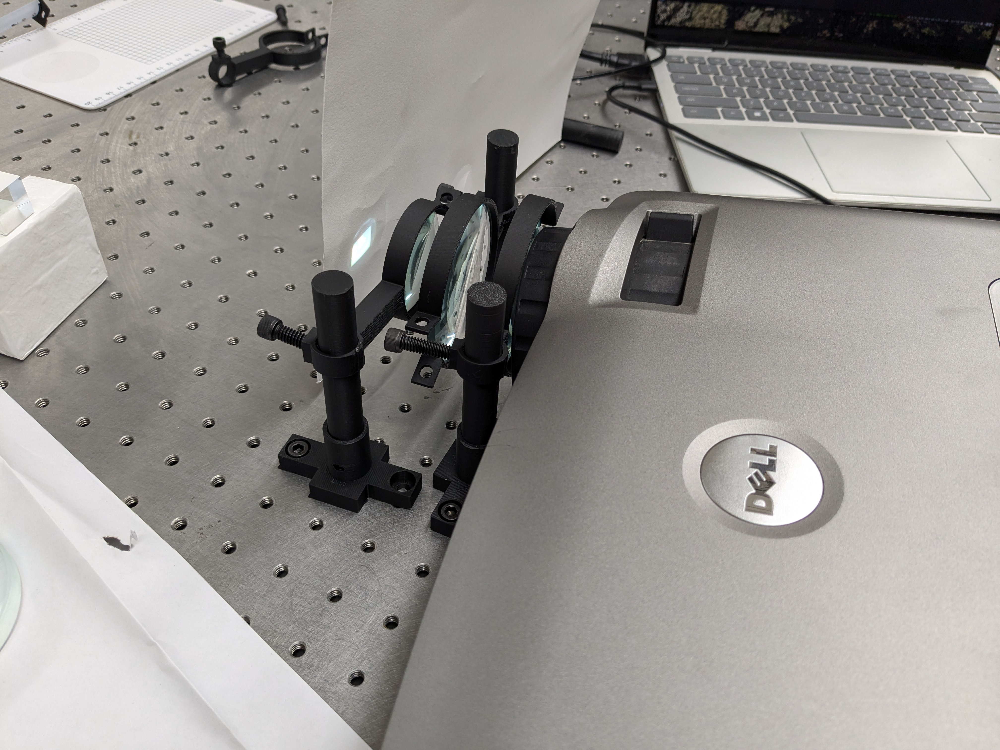

# Log 2

### 3d printed files

after a lot of iterations of my components, I got most of them to work pretty well. 

The biggest pain was learning what was considered 'good' practice in freecad, namely not
overusing tools like the datum plane too much, and using references to other constraints to define
geometry. The former caused a LOT of trouble when I was trying to use the base 3 inch lens
diameter holder for my 2 inch diameter holder, with a lot of the sketches "detatching" from their
respective datum plane and causing the geometries to break. 

The latter was super helpful in the same regard; it prevented my geometry from breaking often
if I changed certain dimensions. 

I initially designed the 3 inch and 2 inch lens holders to utilize threaded holes to "clamp"
down on the lens; ie, the inner diameter of the holder would be greater than that of the lens, 
and the diameter should "decrease" as I thread the screw between the 2 holes. 

This design was pretty terrible, as I'd either have to have a huge gap between the two threads,
which would require a comically long screw, or i'd have to include more complex geometries to 
account for the curveture of the outer diameter. 

Currently i've settled on a design where the inner diameter is smaller than the diameter of the lens, such that the holder "stretches" to accomodate the lens, and the elasticity of the material is utilized to "hold on" to the lens. It works well right now, but I feel like repeated insertion/removal of lenses from this setup would cause the holder to loose its elastic property, or to even snap. 

Talking about snapping, this occured pretty often with a lot of the components, namely when trying to thread the M4 screws into the holes which were meant to secure the components to each other (shaft to base, shaft to lens, etc). I'll have to add some additional material at the "junctions" of each component to prevent this, but as of right now the 3d printed components are serving me well. 

### Optical Setup

So far this has mainly been just "playing around" with the optics to get a better feel of how focal lengths, concave and convex lenses work in general. The theory and equations only go so far, so actually seeing the image being formed after placing various combinations of lenses was really fascinating. 

One of the biggest hurdles I came across was how quickly the light "diverged" after exiting the lenses. I guess in my head and simulations I was assuming that the light would act as a point source, and so filling the aperature of each lens would be trivial, but I didnt really grasp how "big" the projected screen was. 

I was originally constrained to working with a 2 sets of 20,30 and 50 cm focal length lenses (both concave and convex), one of diameter 3 inches and the other of 2. I initially thought I could use 1 or 2 of the 3 inch lenses to demagnify image to an appropriate size, after which I could use the 2 inch lenses, but this wasn't the case as even at close range the lenses struggled to focus the light "fast" or "close" enough.

I ended up buying a 10 cm focal length lens of diameter 2 inches, which has worked incredibly well so far in focusing the image. I'm still getting the feel of how the lenses really interact with each other, and still somewhat struggle in effectively using the concave lenses. 
I know that they should act to "spread out" the light, as opposed to convex lenses, but 
I havent really been able to leverage that. My idea was to use them to "slow down" how fast the light converged, namely so I could pass the light through a beam splitter before refocusing it on either end of the beam splitter.

Putting these issues aside, I was honestly amazed at how clear the projected image was. For a large part, I was able to get an image that was around 20 by 15 mm in size. 
i'm not fully sure how the projector handles resizing of resolution via screen mirroring. 
The laptop I was using had a native resolution of 1920x1200, and the projector a resolution of 1400x1050. 
I assume this means some details are lost, as the projector cant display as many pixels as the original image from the laptop can. 
The source has a pixel density of around 250 pixels per square inch, or around 10 pixels per millimeter. 
Given the projector has a resolution of 1400x1050, and that the output image was roughly 20 by 15 millimeters, this gives a pixel density of 70 pixels/mm in both x and y. 

Overall this gives a shirnkage of a factor of 9.4 horizontally and 11.3 vertically. 
This *should* mean that a 1mm feature on the original image appears as a 0.11 mm wide and 0.088 mm tall on the projected image, or around 100 micrometers. 

Overall this is pretty amazing. However, I noticed some curveture around the edges of the image, which leads me to believe spherical abberation is occuring. In my last log I somehwhat discounted any kind of abberations being an issue, assuming that because the setup was so simple I wouldn't need to worry about it. But in hind sight, using a lens with such a close focal point, while also being small in diameter (2 inches compared to the other 3 inch diameter lenses), it makes sense this would occur.

The video I took from my phone is incredibly poor quality, as evident by the high shutter speed resulting in being able to see the colorwheel spinning (which admittedly, was super cool). It also didnt caputre the sharpness of the projected image, but the fact you can distinctly make out the letters and shapes is a good sign. 

A solution to this would be to either use the same focal length lens except with a larger diameter, avoiding having the image "fill" the aperature, as I believe spherical abberation occurs the most around the edges of the lens, OR to add additional lenses behind the final focusing lens so that the incoming image has a smaller "size". 

I believe the biggest constraints I have in implementing my final optical setup is

1) the focal length is too close: I struggle to direct the beam into the beam splitter while maintaining focus, even while using a 20 cm concave lens to "slow" the convergence of light. I believe the main issue is that the image is actually forming *inside* of the beam splitter, making it impossible to project onto any surface. I might need to go with a significantly more complicated system to first focus the light into a beam that can "fit" into the dimensions of the beam splitter, after which (once exiting the beam splitter) it can be further focused to the final desired magnification. 

2) I dont have enough 3d printed components: Should be easy to solve, just print more components. However in the meantime, i've ended up just holding the lenses at various lengths from each other by hand to experiment with the demagnification and focusing of the image. Having some more standard 'sized' would also help, as the 1-inch grid pattern of the optical table is hindering me in making fine adjustments for focus. printing more optical holders should also allow me to experiment more with the idea of collaminating the light to make "working" with it easier. 

### Further Development

Now that I have the basics of the optical setup done, I think the next step should be to design a more permanent fixture to house the optics. My idea was to 3d print a kind of "sleeve" that would fit over
the projectors lens, which would then allow me to stack any combination/permutation of lenses inside of it to achieve the kind of magnification/focusing I need. In my initial setup I was somewhat limited by the 1-inch grid pattern of the optical table, which meant my lenses had to be spaced out. According to the compound lens equation, this would in effect reduce the aggregate focus of the lenses, and so this fixture should eliminate that by making sure all the lenses are in contact, minimizing the distance between them. I *hope* this results in the spherical abberation being minimized, as a result of the light being focused through the center of each lens instead of the edges (which I believe is the cause of the abberation), given that the light has less distance to disperse before reaching the lens. 

I'm also at somewhat of a crossroad in my implementation; I could either attempt to implement the setup by relying on a bunch of lenses to periodically refucs the light to avoid its dispersion/spreading out, but this would make it difficult to work with, especially in focusing it through the beam splitter. 
On the other hand, I could attempt to collaminate the light by using more of the high-power lenses, hence making it easier to work with, especially in focusing it through the beam splitter and the microscope, but this would be expensive (relatively, this is all coming out of my own pocket and the high-power lens costed around 20 dollars), and im not entirely sure it would work in capturing enough light given its 2 inch diameter. 

Furthermore, i've recently purchased a raspberry-pi 4, which would be useful in running all the software off of. Namely in controlling the projected image, but in the future also controlling the motorized stage to maintain focus more easily. 
I'll also begin work in disassembling the projector to work on the internals, namely removing the color wheel and the UV-block hot mirror. I might also play around with exposing a test-wafer to see if the projector by itself outputs a sufficient amount of UV light, so I might have to bite the bullet and order a UV-pass hot mirror from edmund optics 

